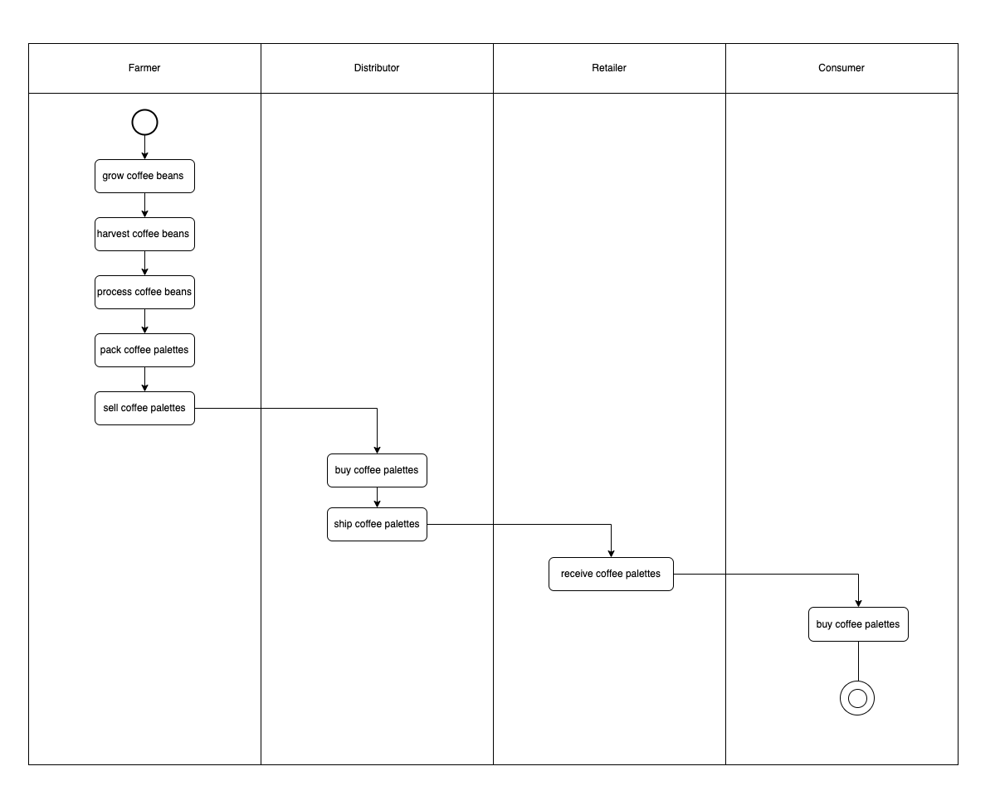
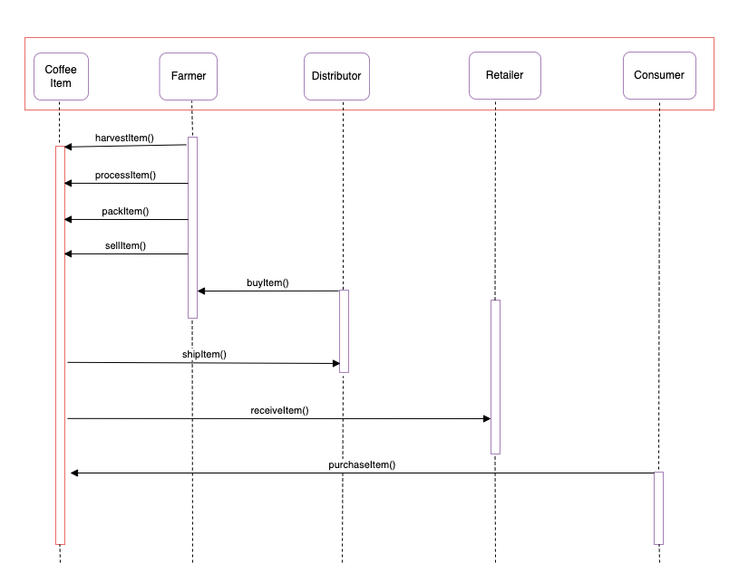
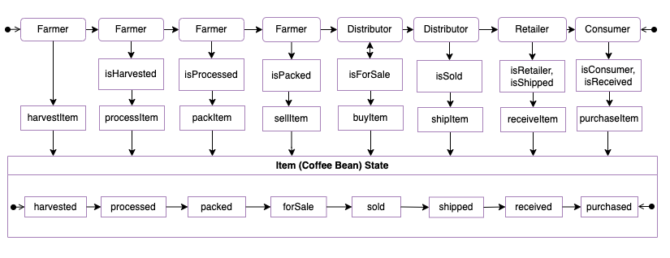
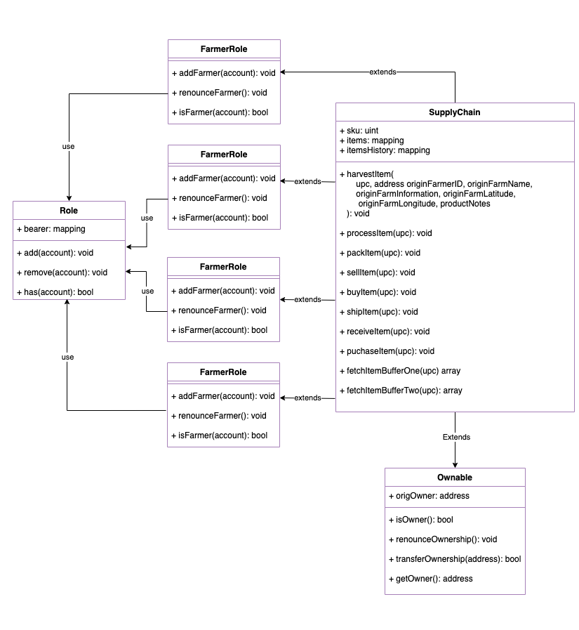
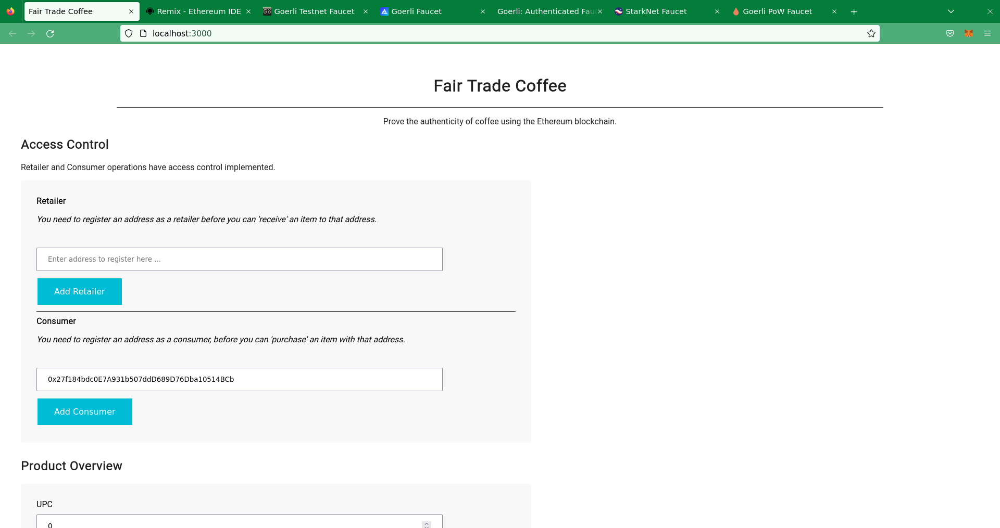
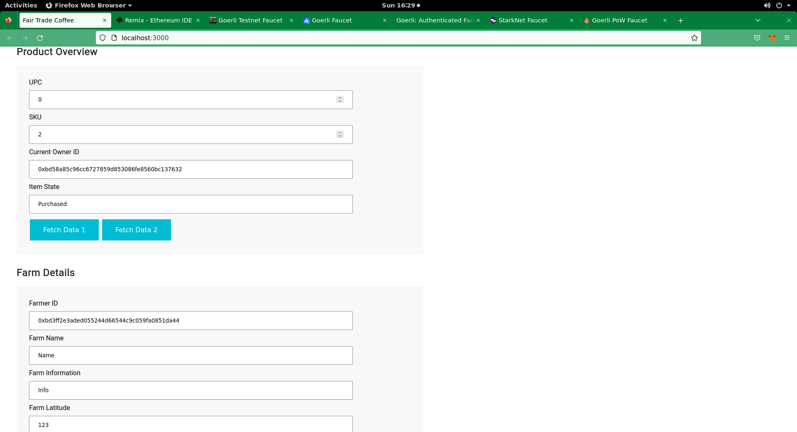
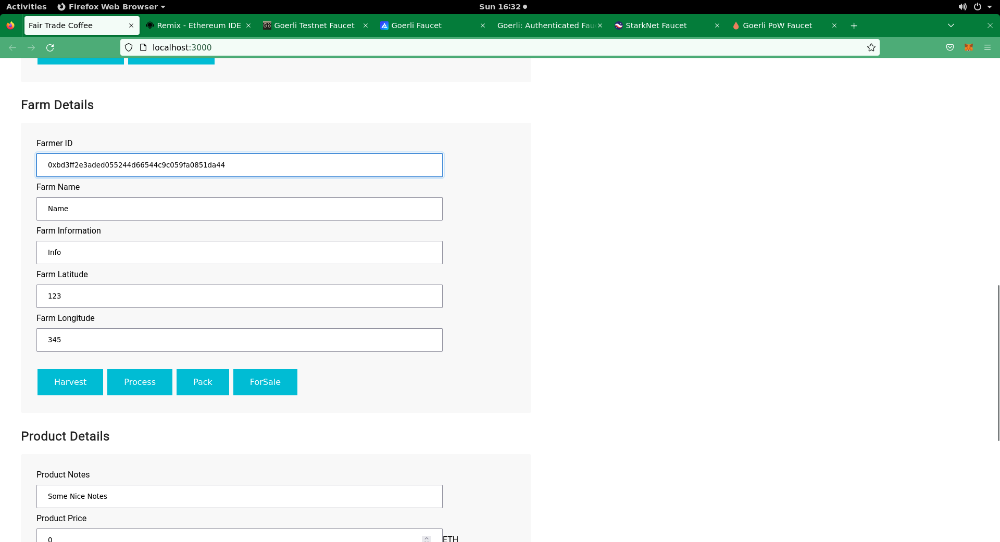
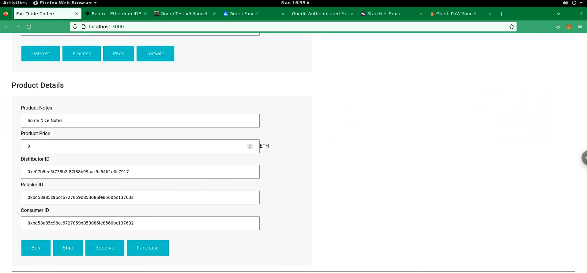

# Ethereum Dapp for Tracking Items through Supply Chain

This repository containts an Ethereum DApp that demonstrates a Supply Chain flow for the coffee supply chain. The actors in the supply chain and the actions they perform is summarised in the table below:


| Actors    | Actions   |
|--------------|-----------|
| Farmer       | Harvest Items<br>Process Items<br>Pack Items<br>Set Items for Sale |
| Distributor  | Buy Items<br>Ship Items |
| Retailer     | Receive Items |
| Consumer     | Purchase Items |

# Project write-up - UML

## Activity Diagram



## Sequence Diagram



## State Diagram



## Class Diagram



# Project write-up - Libraries

* libraries:
```
├── lite-server@2.4.0                         # to run the dapp frontend
├── truffle-hdwallet-provider@1.0.17          # to allow truffle to connect to goerli test network
└── [Web3](./project-6/src/js/web3.min.js)    # for Dapp to interact with the blockchain
```

* Additional:
```
$ truffle version
Truffle v4.1.14 (core: 4.1.14)
Solidity v0.4.24 (solc-js)

$ node -v
v16.14.0
```


# Project write-up - General

## Setting Up Project Locally

### Prerequisites

Please make sure you've already installed ganache-cli, Truffle and enabled MetaMask extension in your browser.


### Running Project locally

1. Clone this repository:

2. Change directory to ```project-6``` folder and install all requisite npm packages (as listed in ```package.json```):

```
cd project-6
npm install
```
3. Launch Ganache:

```
ganache-cli -m "spirit supply whale amount human item harsh scare congress discover talent hamster"
```

Your terminal should look something like this:


4. In a separate terminal window, Compile smart contracts:

```
truffle compile
```

Your terminal should look something like this:


This will create the smart contract artifacts in folder ```build\contracts```.

5. Migrate smart contracts to the locally running blockchain, ganache-cli:

```
truffle migrate
```

Your terminal should look something like this:


6. Test smart contracts:

```
truffle test
```

All 10 tests should pass.


In a separate terminal window, launch the DApp:

```
npm run dev
```


## Unit Tests Result

```
Using network 'development'.

ganache-cli accounts used here...
Contract Owner: accounts[0]  0x27d8d15cbc94527cadf5ec14b69519ae23288b95
Farmer: accounts[1]  0x018c2dabef4904ecbd7118350a0c54dbeae3549a
Distributor: accounts[2]  0xce5144391b4ab80668965f2cc4f2cc102380ef0a
Retailer: accounts[3]  0x460c31107dd048e34971e57da2f99f659add4f02
Consumer: accounts[4]  0xd37b7b8c62be2fdde8daa9816483aebdbd356088


  Contract: SupplyChain
    ✓ Testing smart contract function harvestItem() that allows a farmer to harvest coffee (402ms)
    ✓ Testing smart contract function processItem() that allows a farmer to process coffee (246ms)
    ✓ Testing smart contract function packItem() that allows a farmer to pack coffee (314ms)
    ✓ Testing smart contract function sellItem() that allows a farmer to sell coffee (328ms)
    ✓ Testing smart contract function buyItem() that allows a distributor to buy coffee (1781ms)
    ✓ Testing smart contract function shipItem() that allows a distributor to ship coffee (245ms)
    ✓ Testing smart contract function receiveItem() that allows a retailer to mark coffee received (486ms)
    ✓ Testing smart contract function purchaseItem() that allows a consumer to purchase coffee (519ms)
    ✓ Testing smart contract function fetchItemBufferOne() that allows anyone to fetch item details from blockchain (68ms)
    ✓ Testing smart contract function fetchItemBufferTwo() that allows anyone to fetch item details from blockchain (61ms)


  10 passing (5s)
```

# Deploy smart contract on a public test network

Goerli used instead as Rinkeby has been decommissioned

Transaction ID: [0x16e4002cdc89926a305927ba42891e16880915a1672cf0580136932d0752362f](https://goerli.etherscan.io/tx/0x16e4002cdc89926a305927ba42891e16880915a1672cf0580136932d0752362f)
Contract address: [0xcD84a402EA1bC743493a6b005eC97E9e55f9b2C7](https://goerli.etherscan.io/address/0xcd84a402ea1bc743493a6b005ec97e9e55f9b2c7)

```
Using network 'goerli'.
Running migration: 1_initial_migration.js
  Deploying Migrations...
  ... 0x434f648cf05207b21106a2fbdcf0f31e50350f1901206ccd71544b89f2a50f7a
  Migrations: 0x901acac909ac4e537f151f853e6fb6db952ff351
Saving successful migration to network...
  ... 0xa32bbbf9c1c13042643166419af0537ed1b5871911e3bbdba21d820191ad2904
Saving artifacts...
Running migration: 2_deploy_contracts.js
  Deploying FarmerRole...
  ... 0xfe757aad7a587fa783ca8d42bc949ba072908f56e6c4da2a082ae9ad1c658a3c
  FarmerRole: 0x0508271f85f4cb8a057e497f9b75ff50567971ac
  Deploying DistributorRole...
  ... 0x8abbb5cb93a67403d4de77023c3bcc36ebbd3973ef063b2296b3177dcacf93ce
  DistributorRole: 0xb507710e173bd9aa8db2accf0958b9b9850f6af8
  Deploying RetailerRole...
  ... 0x95a63b8008c7b47d774a88d8daec2a0514e4b09650b6d8ad94aabf7568e7869b
  RetailerRole: 0xefe7006438b13d89fc1d74563836e089687e0ebf
  Deploying ConsumerRole...
  ... 0x368c4992578e676020b7a8b99c84783cd392ac6bcbb9040b2be5f7f12f857abb
  ConsumerRole: 0xf989eea439e57023f9707c0b330d5150fa5fac73
  Deploying SupplyChain...
  ... 0x16e4002cdc89926a305927ba42891e16880915a1672cf0580136932d0752362f
  SupplyChain: 0xcd84a402ea1bc743493a6b005ec97e9e55f9b2c7
Saving successful migration to network...
  ... 0xaa80935404a4930bbda9dc48cdb0adf7fc117d82300036d35a21e85368796b2c
Saving artifacts...
```

# Client App (FrontEnd)

The DApp User Interface when running looks like...
Access Control


Product Overview


Farm Details


Product Details



